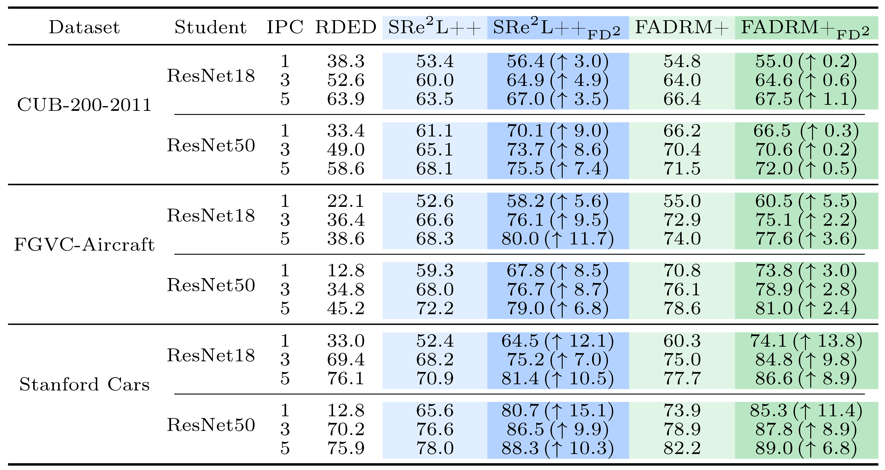

# FD²: A Dedicated Framework for Fine-Grained Dataset Distillation (ECCV 2026)

[](https://arxiv.org/abs/2603.25144)
[](https://eccv.ecva.net/)

A dedicated dataset distillation framework for fine-grained recognition that localizes discriminative regions, constructs fine-grained representations, and preserves diverse class-specific characteristics in distilled datasets.

* The code is available in this repository.
* June 2026: Our paper has been accepted to ECCV 2026!
* March 2026: Preprint was released.

## 🎯 Key Contributions

* **A Dedicated Framework for Fine-Grained Dataset Distillation**
  Introduces FD², a framework specifically designed to address the limitations of conventional dataset distillation methods on fine-grained recognition tasks, where subtle inter-class differences and large intra-class variations must be carefully preserved.

* **Counterfactual Attention Learning**
  Develops a counterfactual attention learning strategy during network pretraining to identify localized discriminative regions and aggregate their representations for constructing and updating fine-grained class prototypes.

* **Fine-Grained Characteristic Constraint**
  Aligns each distilled sample with its corresponding class prototype while simultaneously repelling it from the prototypes of other classes, improving inter-class separability and preserving class-specific discriminative characteristics.

* **Similarity Constraint for Intra-Class Diversity**
  Encourages different distilled samples from the same class to attend to complementary discriminative regions, preventing sample homogenization and preserving diverse fine-grained visual cues.

* **Seamless Integration and Strong Transferability**
  Can be readily integrated into existing decoupled dataset distillation pipelines and consistently improves performance across multiple fine-grained and general image classification datasets.

## Installation

FD² is built on [CV-DD](https://github.com/Jiacheng8/CV-DD). Please refer to the CV-DD repository for environment setup and installation instructions.

## Data Preparation Utilities

* `RDED_patch.py` generates patch based initialization samples from the original training set with a pretrained classifier.
* `get_small_ipc_from_big_ipc.py` transfers a subset of distilled images from a larger IPC setting to a smaller one. After generating the IPC=5 distilled set, set `target_ipc` to `3` or `1` and update the source and target paths to construct the corresponding smaller distilled set.

## Main Results

FD² consistently improves SRe²L++ and FADRM+ on CUB-200-2011, FGVC-Aircraft, and Stanford Cars across IPC=1, 3, and 5. The improvements are especially pronounced on FGVC-Aircraft and Stanford Cars, demonstrating the value of preserving localized and class specific fine-grained cues.

<p align="center">
  
</p>

## Visualization of Distilled Samples

Compared with the corresponding baselines, integrating FD² produces distilled samples with clearer local structures, richer texture details, and more discriminative class specific cues.

<p align="center">
  
</p>

## Citing FD²

If you find this project useful for your research, please use the following BibTeX entry.

```bibtex
@inproceedings{ma2026fd2,
  title={{FD}$^2$: A Dedicated Framework for Fine-Grained Dataset Distillation},
  author={Ma, Hongxu and Li, Guang and Wang, Shijie and Zhou, Dongzhan and Sun, Baoli and Ogawa, Takahiro and Haseyama, Miki and Wang, Zhihui},
  booktitle={Proceedings of the European Conference on Computer Vision (ECCV)},
  year={2026}
}
```
