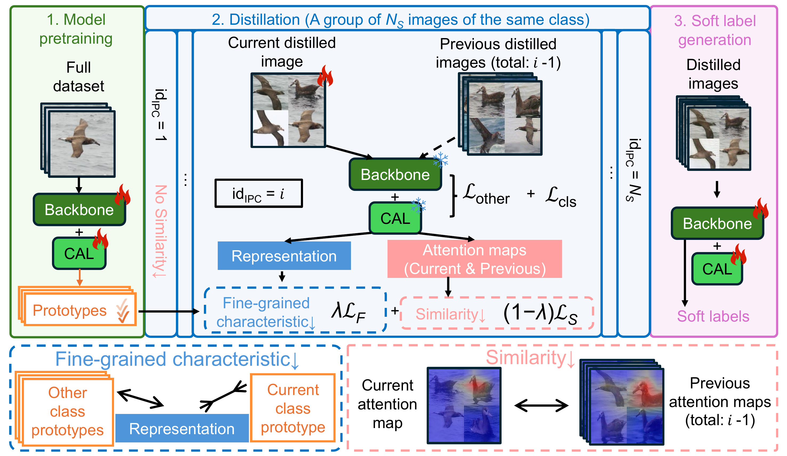

# FD²: A Dedicated Framework for Fine-Grained Dataset Distillation (ECCV 2026)

[](https://arxiv.org/abs/2603.25144)
[](https://eccv.ecva.net/)

A dedicated dataset distillation framework for fine-grained recognition that localizes discriminative regions, constructs fine-grained representations, and preserves diverse class-specific characteristics in distilled datasets.

<p align="center">
  
</p>

* Code will be released soon!
* June 2026: Our paper has been accepted to ECCV 2026!
* March 2026: Preprint was released.

## 🎯 Key Contributions

* **A Dedicated Framework for Fine-Grained Dataset Distillation**
  Introduces FD², a framework specifically designed to address the limitations of conventional dataset distillation methods on fine-grained recognition tasks, where subtle inter-class differences and large intra-class variations must be carefully preserved.

* **Counterfactual Attention Learning**
  Develops a counterfactual attention learning strategy during network pretraining to identify localized discriminative regions and aggregate their representations for constructing and updating fine-grained class prototypes.

* **Fine-Grained Characteristic Constraint**
  Aligns each distilled sample with its corresponding class prototype while simultaneously repelling it from the prototypes of other classes, improving inter-class separability and preserving class-specific discriminative characteristics.

* **Similarity Constraint for Intra-Class Diversity**
  Encourages different distilled samples from the same class to attend to complementary discriminative regions, preventing sample homogenization and preserving diverse fine-grained visual cues.

* **Seamless Integration and Strong Transferability**
  Can be readily integrated into existing decoupled dataset distillation pipelines and consistently improves performance across multiple fine-grained and general image classification datasets.

## Citing FD²

If you find this project useful for your research, please use the following BibTeX entry.

```bibtex
@inproceedings{ma2026fd2,
  title={{FD}$^2$: A Dedicated Framework for Fine-Grained Dataset Distillation},
  author={Ma, Hongxu and Li, Guang and Wang, Shijie and Zhou, Dongzhan and Sun, Baoli and Ogawa, Takahiro and Haseyama, Miki and Wang, Zhihui},
  booktitle={Proceedings of the European Conference on Computer Vision (ECCV)},
  year={2026}
}
```

